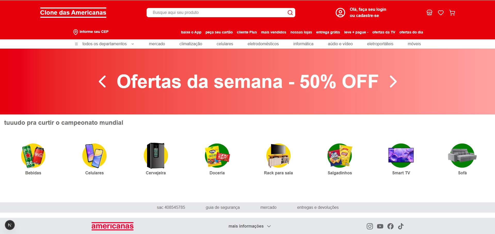

# 🛒 Clone Lojas Americanas

Um clone funcional do e-commerce da Americanas, construído do zero com **Next.js** e foco em **boas práticas de produção**: componentes reutilizáveis, testes end-to-end, integração contínua e deploy automatizado.

[](https://github.com/ivoalsilva/clone-lojas-americanas/actions/workflows/ci.yml)


## 🔗 Demo

**[Ver o projeto ao vivo →](https://clone-lojas-americanas.vercel.app)**

## 📸 Preview



## ✨ Funcionalidades

- 🏠 **Home** com carrossel de banners (navegação manual + auto-rotação) e vitrine de categorias
- 🗂️ **Categorias dinâmicas** — rota `/categoria/[slug]` que lista os produtos de cada categoria
- 📦 **Página de produto** — rota `/produto/[id]` com detalhes e preço formatado
- 🛒 **Carrinho de compras** com estado global (Context API):
  - adicionar e remover itens
  - badge de quantidade no header
  - cálculo do total
  - **persistência** com localStorage (sobrevive ao recarregar a página)
- 🚫 **Páginas 404 customizadas** para rotas e produtos inexistentes
- 📱 **Layout responsivo** (mobile-first)

## 🛠️ Tecnologias

- **[Next.js 16](https://nextjs.org)** (App Router) — Server e Client Components, rotas dinâmicas
- **[React 19](https://react.dev)** — Context API, hooks (`useState`, `useEffect`)
- **[Tailwind CSS 4](https://tailwindcss.com)** — estilização utilitária e responsividade
- **[Cypress](https://www.cypress.io)** — testes end-to-end (E2E)
- **[GitHub Actions](https://github.com/features/actions)** — CI/CD (lint + build + testes a cada push)
- **[Vercel](https://vercel.com)** — deploy contínuo

## 🚀 Como rodar localmente

```bash
# clonar o repositório
git clone https://github.com/ivoalsilva/clone-lojas-americanas.git
cd clone-lojas-americanas

# instalar as dependências
npm install

# rodar em modo de desenvolvimento
npm run dev
```

Abra [http://localhost:3000](http://localhost:3000) no navegador.

## 🧪 Testes

Os testes end-to-end (Cypress) cobrem os fluxos críticos: navegação, categorias, produtos e carrinho.

```bash
# rodar os testes (com o servidor já no ar em outro terminal)
npm run test:e2e

# sobe o servidor + roda os testes automaticamente (usado no CI)
npm run build
npm run test:e2e:ci
```

## 📁 Estrutura

```
src/
├── app/                    # rotas (App Router)
│   ├── categoria/[slug]/   # listagem por categoria
│   ├── produto/[id]/       # detalhe do produto
│   └── carrinho/           # página do carrinho
├── components/             # componentes reutilizáveis (Header, Footer, cards, Banner)
├── context/                # CarrinhoContext (estado global)
└── data/                   # dados de categorias, produtos e banners
cypress/e2e/                # testes end-to-end
.github/workflows/          # pipeline de CI
```

---

Desenvolvido por **[Ivo Silva](https://github.com/ivoalsilva)** 🚀
